# SQLAlchemy Climate Data Analysis and Exploration

## About The Project

### Background

* Perform climate analysis and exploration on Honolulu, Hawaii based on last years' data.

* Design a Flask API based on the queries developed; use Flask to create routes. 

### Built With

* SQLAlchemy
* Flask
* Python
* Numpy
* Pandas 
* Matplotlib
* Jupyter Notebook

## Procedures

### 1. Climate Data Analysis.

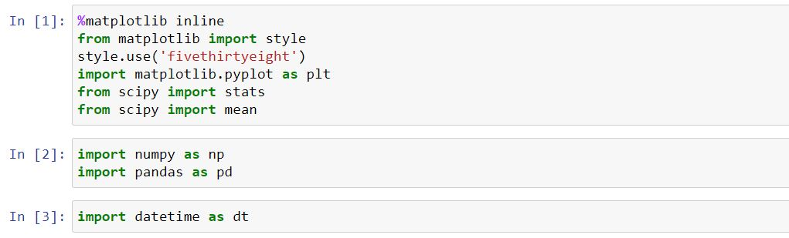

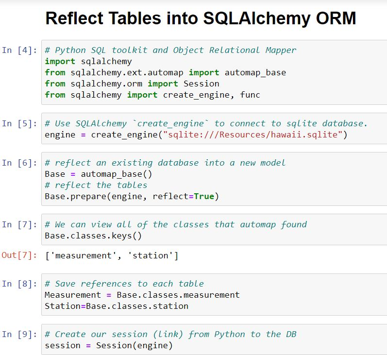

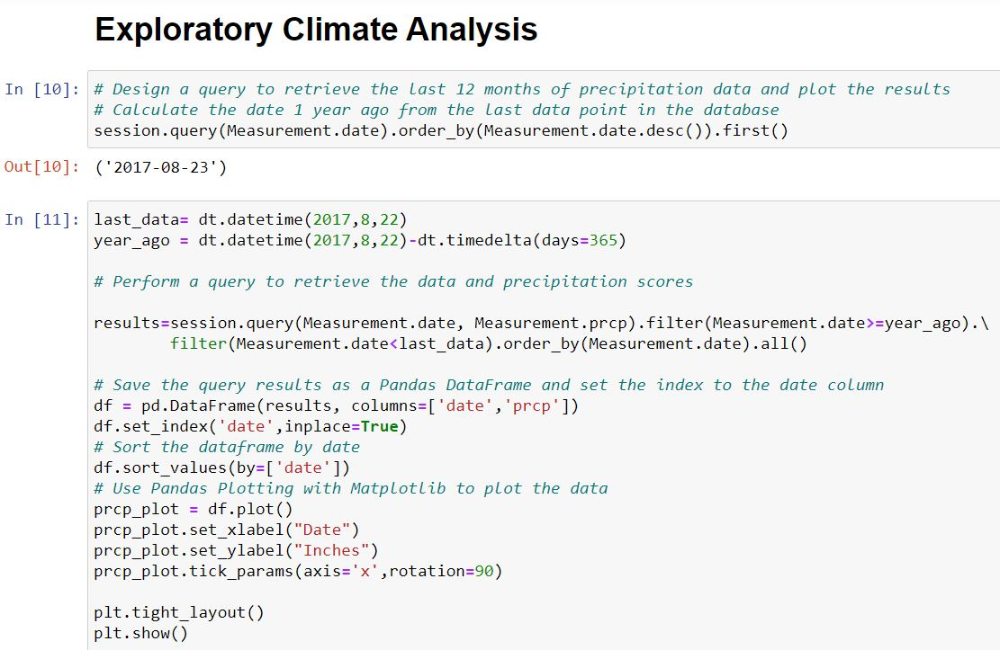

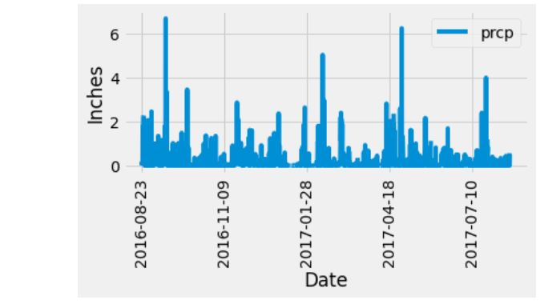

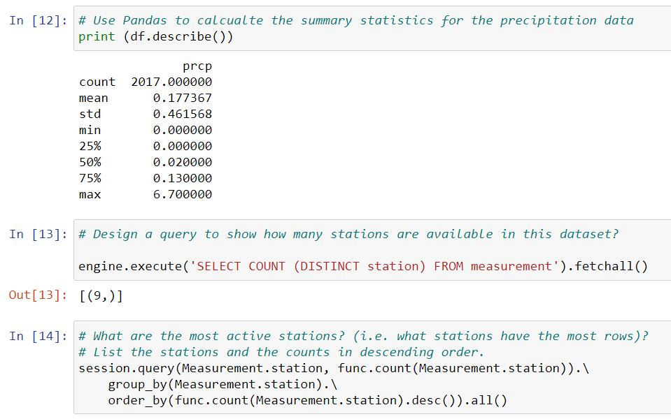

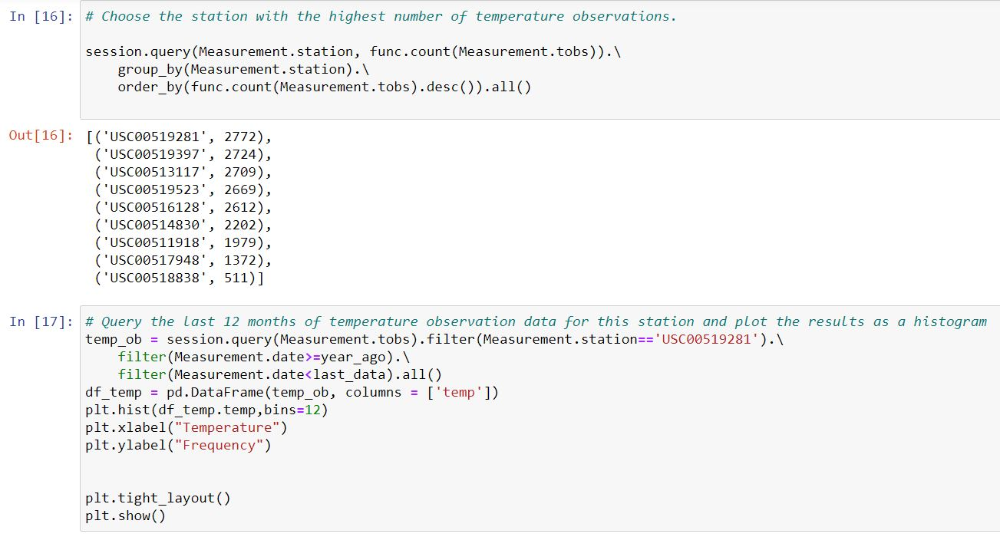

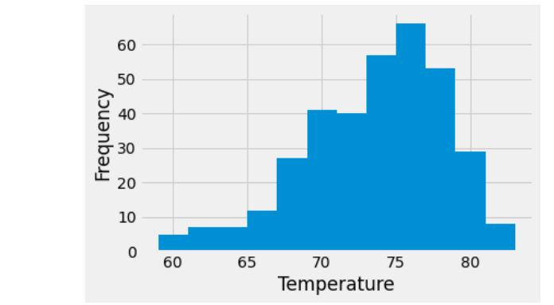

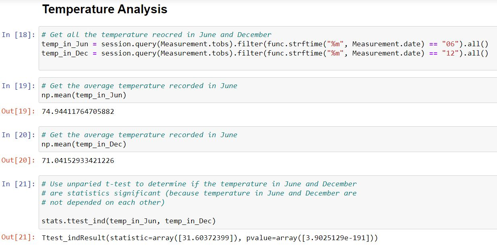

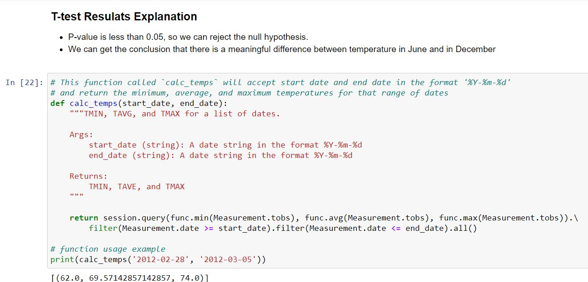

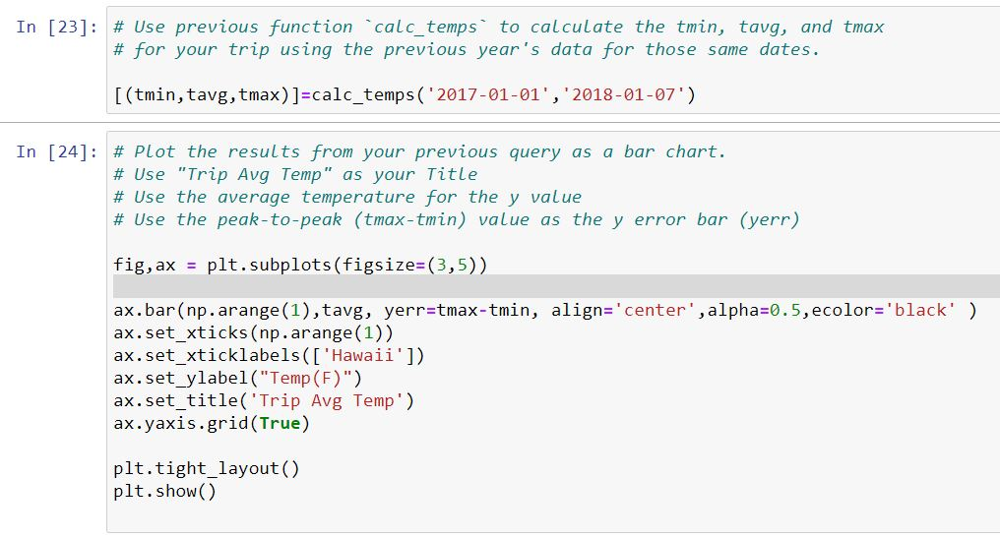

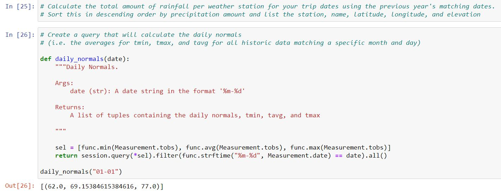

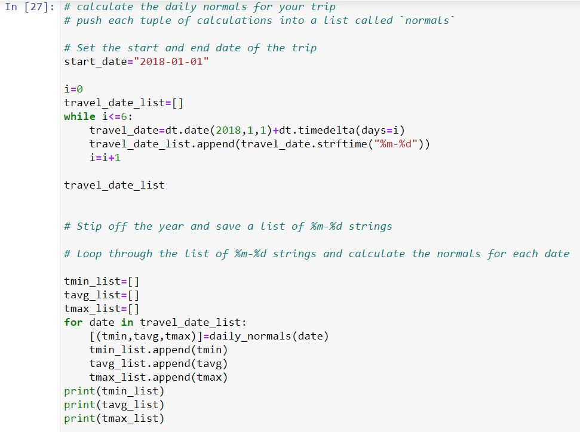

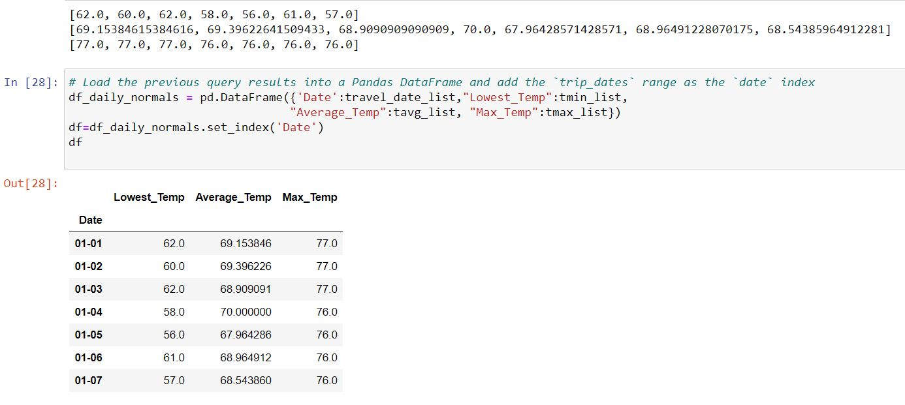

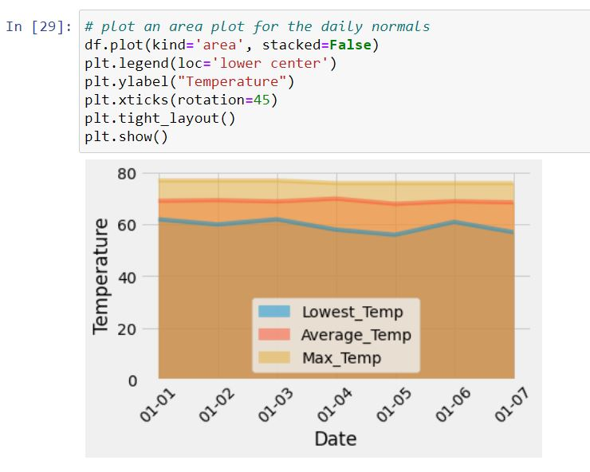

### 2. Climate App

Design a Flask API based on the queries developed before. 

#### Routes

* `/`

  * Home page.

  * List all routes that are available.

* `/api/v1.0/precipitation`

  * Convert the query results to a dictionary using `date` as the key and `prcp` as the value.

  * Return the JSON representation of your dictionary.

* `/api/v1.0/stations`

  * Return a JSON list of stations from the dataset.

* `/api/v1.0/tobs`
  * Query the dates and temperature observations of the most active station for the last year of data.
  
  * Return a JSON list of temperature observations (TOBS) for the previous year.

* `/api/v1.0/<start>` and `/api/v1.0/<start>/<end>`

  * Return a JSON list of the minimum temperature, the average temperature, and the max temperature for a given start or start-end range.

  * When given the start only, calculate `TMIN`, `TAVG`, and `TMAX` for all dates greater than and equal to the start date.

  * When given the start and the end date, calculate the `TMIN`, `TAVG`, and `TMAX` for dates between the start and end date inclusive.
